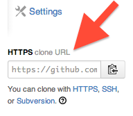
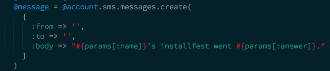

## My Amazing First WDI App

We're going to modify this Sinatra application to make sure that everything works. The aim is for you to publish your very own first web application to the web by the end of the installfest.

# Install

* Create a folder to use for your upcoming project work, I suggest /install_project

```
    cd ~
    mkdir install_project
    cd install_project
```

* Fork this repo by clicking the 'fork' button above


* Get your clone URL from here:



* Clone your forked repository. The command should look something like this:

```
    git clone https://github.com/____YOUR_GITHUB_NAME_______/GAInstallfest.git
```

* Change into your new project folder

```
    cd GAInstallfest
```

* Open the app in Sublime and navigate to the `welcome_app.rb` file

```
    subl .
```

* Fill in the account info here. We'll put what to enter on the board.


* Same thing for the 'from' and 'to' fields:



* Save your file

* Install bundler

```
  gem install bundler --no-ri --no-rdoc
```

* Install the ruby gems required for the application

```
   bundle
```
* Set up your SSH Keys by following these [instructions](https://help.github.com/articles/generating-ssh-keys). Ask us for help if you are having trouble.
* Sign up for Heroku: https://id.heroku.com/signup
* Setup Heroku toolbelt: https://toolbelt.heroku.com
* Login to Heroku by typing:

```
    heroku login
```

* Create an app on Heroku using:

```
    heroku create
```

* Make a note of the URL it gives you. Will be something like
http://cool-bananas-922.herokuapp.com.
* Push the example app from your cloned repository to your heroku repository:

```
    git push heroku master
```
* Cut+paste your heroku URL into your favorite web browser. You should see
the example app.

* Fill in the survey and hit the `submit` button

# Development cycle

You should work through the TODO list below, using the following methodology:

* Run the example application using the following command. You should see the web application running locally in your browser at
http://localhost:4567.

```
    ruby welcome_app.rb
```

* Make a change locally in your text editor.

* If you make a change to the welcome_app.rb, you'll need to restart the
server. You do this by killing the process using CTRL+C in your terminal window.

* Once you're happy with your change, save your changes to your local repo
using the following commands:

```
    git add .
    git commit -m "Write down briefly what you changed in here"
    git push heroku master
```

* Test your changes on the Heroku URL you remembered from before. Make sure it worked!

* At the end of the day, push your changes to your own github profile using

```
   git push origin master
```

# TODO

Working in pairs, see if you can figure out how to do the following:

1. Change the application so that it sends a text message to your mobile phone.
2. Change the title in the browser title bar to something more exciting.
3. Change the images to seem more win-y, fail-y, or meh-y. Check out [Giphy](http://giphy.com/) for some good options :)
4. Employ some of the CSS tricks you picked up during the prework to
pretty the page up a bit:
  * Try out some different fonts
  * Try out some different font sizes
  * Try out some different colors
  * Try changing the layout, so that the form questions appear to the right hand
  side of the image
  * Change the appearance of the submit button so that it is something that you
  would like to click
